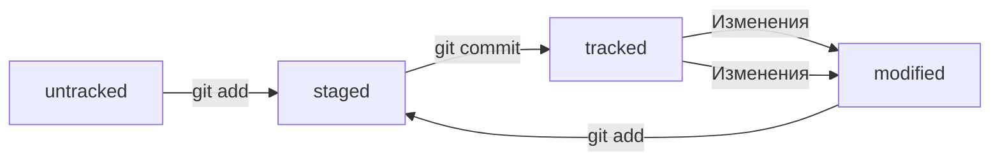

# Хеш - идентификатор коммита

Хеширование (от англ. hash, «рубить», «крошить», «мешанина») — это способ преобразовать набор данных и получить их «отпечаток» (англ. fingerprint).

Информация о коммите — это набор данных: когда был сделан коммит, содержимое файлов в репозитории на момент коммита и ссылка на предыдущий, или родительский (англ. parent), коммит. Git хеширует (преобразует) эту информацию с помощью алгоритма SHA-1 (от англ. Secure Hash Algorithm — «безопасный алгоритм хеширования») и получает для каждого коммита свой уникальный хеш — результат хеширования.

В то время, как результат работы метода hashCode() — это целое число, результат хеширования в Git — символьная строка. Она относительно коротка (40 символов в случае SHA-1) и состоит из цифр 0—9 и латинских букв A—F (неважно, заглавных или строчных). Хеш обладает следующими важными свойствами:
- если хеш получить дважды для одного и того же набора входных данных, то результат будет гарантированно одинаковый;
- если хоть что-то в исходных данных поменяется (хотя бы один символ), то хеш тоже изменится (причём сильно).

# Лог

Вот из каких элементов состоит описание:
- Строка из цифр и латинских букв после слова commit — это уже знакомый вам хеш коммита.
- Author — имя автора и его электронная почта.
- Date — дата и время создания коммита.
- Сообщение к коммиту.

Если в репозитории уже много коммитов — например, сотни или тысячи, — пригодится сокращённый лог. С ним можно быстро найти нужный коммит по описанию.

Сокращённый лог вызывают командой git log с флагом --oneline (англ. «одной строкой»). При этом в терминале появятся только первые несколько символов хеша каждого коммита и комментарии к ним.

Сокращённый хеш (первые несколько символов полного) можно использовать точно так же, как и полный. Для этого команда git log --oneline автоматически подбирает такую длину сокращённых хешей, чтобы они были уникальными в пределах репозитория и Git всегда мог понять, о каком коммите идёт речь.

# HEAD — всему голова

Файл HEAD (англ. «голова», «головной») — один из служебных файлов папки .git. Он указывает на коммит, который сделан последним (то есть на самый новый).

Внутри HEAD — ссылка на служебный файл: refs/heads/master (или refs/heads/main в зависимости от названия ветки). Если заглянуть в этот файл, можно увидеть хеш последнего коммита.

# Статусы файлов

- untracked (англ. «неотслеживаемый») 

Новые файлы в Git-репозитории помечаются как untracked, то есть неотслеживаемые. Git «видит», что такой файл существует, но не следит за изменениями в нём. У untracked-файла нет предыдущих версий, зафиксированных в коммитах или через команду git add.

- staged (англ. «подготовленный») 

После выполнения команды git add файл попадает в staging area (от англ. stage — «сцена», «этап [процесса]» и area — «область»), то есть в список файлов, которые войдут в коммит. В этот момент файл находится в состоянии staged.

- tracked (англ. «отслеживаемый») 

Состояние tracked — это противоположность untracked. Оно довольно широкое по смыслу: в него попадают файлы, которые уже были зафиксированы с помощью git commit, а также файлы, которые были добавлены в staging area командой git add. То есть все файлы, в которых Git так или иначе отслеживает изменения.

- modified (англ. «изменённый») 

Состояние modified значит, что Git сравнил содержимое файла с последней сохранённой версией и нашёл отличия. Например, файл был закоммичен и после этого изменён.

Вот что ещё важно учесть:

- Для файлов в состояниях staged и modified обычно не указывается, что они также tracked, потому что это состояние подразумевается.
- Команда git add добавляет в staging area только текущее содержимое файла. Если вы, например, сделаете git add file.txt, а затем измените file.txt, то новое содержимое файла не будет находиться в staging. Git сообщит об этом с помощью статуса modified: файл изменён относительно той версии, которая уже в staging. Чтобы добавить в staging последнюю версию, нужно выполнить git add file.txt ещё раз.

## Типичный жизненный цикл файла в Git

